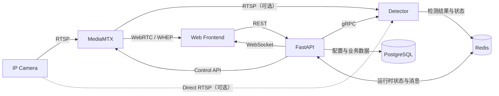

# SOP Vision

SOP Vision 是一个面向 IP Camera 的视觉分析平台。平台将视频接入、业务控制和视觉算法解耦：MediaMTX 负责视频路由与浏览器播放，FastAPI 负责控制面与业务 API，Detector 负责检测、Tracking 和 SOP 判断。

> 项目正在按目标架构逐步实现。当前仓库已包含 MediaMTX、FastAPI 和 PostgreSQL 的 Compose 基础设施；Detector、Redis、前端、数据库持久化及完整摄像头 CRUD 尚待接入。

## 架构概览



核心分工：

| 组件 | 核心职责 |
| --- | --- |
| MediaMTX | 接入和代理 RTSP 流，为浏览器提供 WebRTC/WHEP，并向 Detector 提供可选的统一 RTSP 源 |
| FastAPI | 用户与权限、摄像头和算法配置、MediaMTX 管理、Detector 控制、实时结果聚合及前端 API |
| Detector | 视频解码、检测、Tracking、SOP 判断和运行时状态上报；生命周期独立于 FastAPI |
| PostgreSQL | 持久化配置和业务数据，是 Desired State 的唯一事实源 |
| Redis | Detector 心跳、Actual State、缓存和实时消息，不承担正式配置持久化 |
| Web Frontend | 通过 FastAPI 管理业务，通过 MediaMTX 播放视频，并叠加实时检测信息 |

更完整的服务边界、数据模型与容错策略见[总体架构设计](docs/vision-platform-architecture.md)。

## 关键数据流

- 视频播放：`IP Camera → MediaMTX → WebRTC/WHEP → Browser`
- Detector 控制：`FastAPI → gRPC → Detector`
- 实时检测：`Detector → Redis Pub/Sub → FastAPI WebSocket → Browser`
- 可靠业务事件：`Detector → Redis Stream → FastAPI → PostgreSQL`
- 配置恢复：`PostgreSQL Desired State → Reconciler → MediaMTX / Detector Actual State`

前端只通过 FastAPI 操作业务资源，不直接访问 MediaMTX Control API、Redis、PostgreSQL 或 Detector gRPC。视频不经过 FastAPI；浏览器使用 `<video>` 播放，`<canvas>` 只绘制 bbox、ROI 和 SOP 信息。

## Detector 视频源

Detector 支持两种源模式：

- `DIRECT`：直接连接 Camera，链路最短，MediaMTX 故障不影响算法，但会增加摄像头连接数和局域网流量。
- `MEDIAMTX`：通过 MediaMTX 拉流，地址统一且适合多消费者，但 MediaMTX 会进入算法链路。

具体模式应根据摄像头 RTSP 会话上限、网络带宽、延迟和可用性要求选择。

## 架构原则

1. 视频、业务数据和算法执行相互解耦。
2. PostgreSQL 保存持久化的 Desired State，Redis 保存运行时 Actual State。
3. Command、Event、Telemetry 使用不同通信语义：gRPC、Redis Stream、Redis Pub/Sub。
4. MediaMTX 和 Detector 的实际状态由控制面根据持久化配置进行对账恢复。
5. Detector 不在算法主循环同步等待 FastAPI、Redis 或 PostgreSQL；外围服务故障时继续使用当前配置或 Last Known Good 配置。

## 当前仓库

```text
.
├── backend/                       # FastAPI 控制面（当前包含 Stream Gateway 骨架）
├── detector/                      # Detector 预留目录
├── docs/                          # 项目文档
├── frontend/                      # 前端预留工程
├── compose.yaml                   # 当前启动 PostgreSQL、MediaMTX 和 Backend
└── .env.example
```

当前实现范围：

- FastAPI 应用、存活/就绪检查和 MediaMTX 异步客户端。
- 摄像头模型、路由及服务骨架；CRUD 尚未实现。
- MediaMTX Control API 仅在 Compose 内网开放。
- PostgreSQL 已接入 Compose，但 Backend 尚未实现持久化。
- 动态 MediaMTX Path 当前属于运行时状态，服务重启后不保证保留。

## 快速启动

要求：Docker 与 Docker Compose。

```bash
cp .env.example .env
docker compose config
docker compose up --build --wait
```

验证当前服务：

```bash
curl http://localhost:8000/api/v1/health/live
curl http://localhost:8000/api/v1/health/ready
docker compose ps
```

常用地址：

| 地址 | 用途 |
| --- | --- |
| <http://localhost:8000/docs> | FastAPI OpenAPI |
| <http://localhost:8000/api/v1/health/live> | Backend 存活检查 |
| <http://localhost:8000/api/v1/health/ready> | Backend 与 MediaMTX 连通性检查 |
| `http://localhost:8889/{path}/whep` | 浏览器 WHEP 播放地址 |

停止服务：

```bash
docker compose down
```

局域网部署时，需要在 `.env` 中将 `MTX_WEBRTCADDITIONALHOSTS` 和 `PUBLIC_WEBRTC_BASE_URL` 配置为浏览器实际可达的宿主机 IP 或域名。容器之间通过 Compose 服务名通信，不使用 `localhost`。

## Backend 开发

Backend 使用 Python 3.12、FastAPI、uv、pytest 和 Ruff。在 `backend/` 目录执行：

```bash
uv sync
uv run pytest
uv run ruff check .
uv run ruff format --check .
```

本地启动方式及完整配置项见 [Backend README](backend/README.md)。
