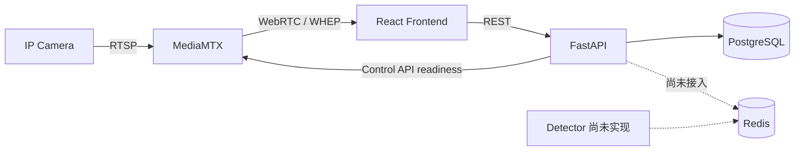

# SOP Vision

SOP Vision 是面向 IP Camera 的视觉分析平台。当前仓库已经完成可运行的基础设施、
FastAPI/React 工程骨架，以及 Cameras MVP 的完整 Foundation；Camera CRUD、状态投影、
WHEP 播放器和 Detector 业务仍未实现。

## 当前状态

| 范围                | 状态     | 说明                                                                     |
| ------------------- | -------- | ------------------------------------------------------------------------ |
| 本地运行栈          | 可用     | PostgreSQL、Redis、MediaMTX、FastAPI、React/Nginx                        |
| Backend 公共基础    | 可用     | 应用工厂、数据库生命周期、Alembic、统一 Problem、Trace ID、CORS          |
| 健康检查            | 可用     | `GET /api/v1/health/live` 与 `GET /api/v1/health/ready`                  |
| Cameras Foundation  | 已完成   | 领域聚合、Repository/UoW、关系模型、OpenAPI、前端 Client/Mock 和 CI 门禁 |
| Cameras 业务切片    | 未实现   | 七个目标路由已注册用于冻结契约，但 handler 仍是占位，不能作为可用 API    |
| Web UI              | 部分可用 | App Shell、路由、主题和通用页面状态已完成；Cameras/Tasks 是页面骨架      |
| Detector 与实时检测 | 未实现   | `detector/` 仅为预留目录；Backend 尚未接入 Redis 客户端或 WebSocket      |

精确的 Cameras 状态与目标契约见 [Cameras MVP](docs/cameras-mvp/README.md)。

## 架构边界



- PostgreSQL 是持久化业务配置的事实源；Redis 预留给运行时状态和消息，不保存正式配置。
- MediaMTX 负责视频接入和浏览器媒体传输；FastAPI 不代理视频字节。
- FastAPI 是控制面。Frontend 不直接访问 PostgreSQL、Redis 或 MediaMTX Control API。
- Detector 应独立运行；其目标边界与尚未落地的链路见
  [总体架构](docs/vision-platform-architecture.md)。

## 仓库结构

```text
.
├── backend/              # FastAPI、SQLAlchemy、Alembic 和后端测试
├── contracts/            # 确定性生成并提交的 OpenAPI 契约
├── detector/             # Detector 预留目录，当前无实现
├── docs/                 # 架构、产品、Cameras MVP 与设计系统
├── frontend/             # React、TypeScript、Vite 和 Nginx 镜像
├── scripts/              # 跨端契约与敏感数据门禁
├── compose.yaml          # 完整运行栈
├── compose.dev.yaml      # 宿主机开发所需的额外端口
└── .env.example
```

## 使用 Compose 运行

要求 Docker 与 Docker Compose。首次启动：

```bash
cp .env.example .env
docker compose --env-file .env config
docker compose --env-file .env up --build --wait
docker compose --env-file .env exec backend alembic upgrade head
```

访问地址：

- Frontend：<http://localhost:8000>
- OpenAPI UI：<http://localhost:3001/docs>
- Backend 存活检查：<http://localhost:3001/api/v1/health/live>
- MediaMTX WHEP 服务：<http://localhost:8889>

容器启动不会自动执行数据库迁移；部署新 revision 后必须显式运行 `alembic upgrade head`。
当前 Frontend 只展示应用 Shell 和页面骨架。调用 Cameras 目标路由会进入占位 handler，
不代表 CRUD 已可使用。

停止服务使用：

```bash
docker compose down
```

命名卷默认保留。只有明确需要删除本地 PostgreSQL/Redis 数据时才使用
`docker compose down --volumes`。

## 宿主机开发

要求 Python 3.12、uv、Node.js 24 和 pnpm 11。配置按运行位置拆分，容器服务名不能用于
宿主机进程：

```bash
cp .env.example .env
cp backend/.env.local.example backend/.env.local
cp frontend/.env.local.example frontend/.env.local

docker compose -f compose.yaml -f compose.dev.yaml \
  up -d --wait postgres redis mediamtx
```

安装依赖并迁移数据库：

```bash
cd backend
uv sync --locked
uv run --env-file .env.local alembic upgrade head

cd ../frontend
corepack enable
pnpm install --frozen-lockfile
```

分别启动 Backend 和 Frontend：

```bash
cd backend
uv run --env-file .env.local uvicorn app.main:app \
  --app-dir src --host 127.0.0.1 --port 3001 --reload

cd frontend
pnpm dev
```

配置变量、数据库测试和 MSW 场景分别见 [Backend README](backend/README.md) 与
[Frontend README](frontend/README.md)。

## 质量检查

```bash
cd backend
uv run --env-file .env.local pytest
uv run ruff check .
uv run ruff format --check .

cd ../frontend
pnpm test
pnpm lint
pnpm format:check
pnpm build

cd ..
bash scripts/check-cameras-contracts.sh
bash scripts/check-cameras-sensitive-data.sh
```

未配置 `TEST_DATABASE_URL` 时，PostgreSQL 迁移和 Repository 集成测试会跳过；完整验收必须
确认这些测试实际执行。

## 文档

从 [文档入口](docs/README.md) 开始阅读。核心文档包括：

- [总体架构](docs/vision-platform-architecture.md)
- [产品范围](docs/product-requirements.md)
- [Cameras MVP](docs/cameras-mvp/README.md)
- [Design System](docs/design-system/README.md)
- [实时检测数据设计](docs/realtime-detection-design.md)
