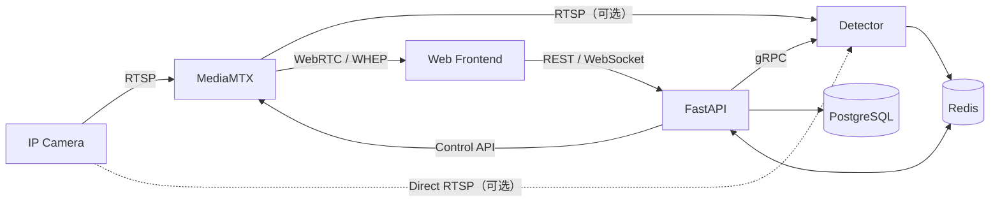

# SOP Vision

SOP Vision 是面向 IP Camera 的视觉分析平台。MediaMTX 负责视频接入与浏览器播放，
FastAPI 负责业务控制，Detector 负责检测、Tracking 和 SOP 判断。

> 项目正在按目标架构增量实现。准确的 Cameras 范围与进度见
> [Cameras MVP](docs/cameras-mvp/README.md)；完整服务边界见
> [总体架构设计](docs/vision-platform-architecture.md)。

## 架构



- PostgreSQL 保存持久化 Desired State；Redis 保存运行时 Actual State、缓存和消息。
- 前端通过 FastAPI 管理业务资源，通过 MediaMTX 播放视频；FastAPI 不代理视频字节。
- Detector 生命周期独立于 FastAPI，可直接读取 Camera 或通过 MediaMTX 读取统一视频源。

## 仓库

```text
.
├── backend/              # FastAPI 控制面
├── detector/             # Detector 预留目录
├── docs/                 # 架构、需求和实施文档
├── frontend/             # React、TypeScript、Vite
├── compose.yaml          # 完整服务
├── compose.dev.yaml      # 宿主机开发端口覆盖
└── .env.example
```

当前仓库包含 FastAPI、React 前端、PostgreSQL、Redis 和 MediaMTX。Cameras 已具备数据库、
领域、Repository/UoW 和 HTTP 公共基础，业务 CRUD、状态投影和播放器仍按 MVP 计划实施；
Detector 与 Redis 应用客户端尚未接入。

## 环境配置

环境要求：Docker 与 Docker Compose、Python 3.12 与 uv、Node.js 24 与 pnpm 11。

项目按运行位置拆分配置，不能把容器服务名用于宿主机进程：

| 文件                  | 使用者             | 地址规则                                      |
| --------------------- | ------------------ | --------------------------------------------- |
| `.env`                | Compose 和应用容器 | 使用 `postgres`、`redis`、`mediamtx` 等服务名 |
| `backend/.env.local`  | 宿主机 Uvicorn     | 使用 `127.0.0.1` 和开发端口                   |
| `frontend/.env.local` | 宿主机 Vite        | 使用浏览器可访问的 Backend 地址               |

首次开发前执行：

```bash
cp .env.example .env
cp backend/.env.local.example backend/.env.local
cp frontend/.env.local.example frontend/.env.local
```

实际配置文件不会提交。修改 PostgreSQL 用户、密码或端口时，需同步修改根 `.env` 和
`backend/.env.local` 的连接串。

## 日常开发

日常开发只用 Compose 启动基础设施，Backend 和 Frontend 在宿主机运行，以使用自动重载、
HMR 和本地调试。

安装依赖：

```bash
cd backend
uv sync

cd ../frontend
corepack enable
pnpm install --frozen-lockfile
```

启动基础设施：

```bash
docker compose -f compose.yaml -f compose.dev.yaml \
  up --wait postgres redis mediamtx
```

宿主机端口为 PostgreSQL `5432`、Redis `6379`、MediaMTX Control API `9997`、RTSP
`8554`、WebRTC/WHEP `8889`。

分别启动 Backend 和 Frontend：

```bash
cd backend
uv run --env-file .env.local uvicorn app.main:app \
  --app-dir src --host 127.0.0.1 --port 3001 --reload

cd frontend
pnpm dev
```

- Frontend：<http://127.0.0.1:8000>
- OpenAPI：<http://127.0.0.1:3001/docs>

停止基础设施但保留数据：

```bash
docker compose -f compose.yaml -f compose.dev.yaml stop postgres redis mediamtx
```

## Compose 全栈

```bash
test -f .env || cp .env.example .env
docker compose --env-file .env config
docker compose --env-file .env build
docker compose --env-file .env up --wait
```

容器版 Backend/Frontend 不挂载源码。代码或 `FRONTEND_API_BASE_URL` 变化后需重新构建对应
镜像；该前端地址在构建时写入静态产物。停止服务使用 `docker compose down`，它会保留命名
数据卷；只有明确需要清空本地数据时才使用 `docker compose down --volumes`。

局域网部署时，将 `MTX_WEBRTCADDITIONALHOSTS` 和 `PUBLIC_WEBRTC_BASE_URL` 配置为浏览器
可达的 IP 或域名。

## 质量检查

```bash
cd backend
uv run --env-file .env.local pytest
uv run ruff check .
uv run ruff format --check .

cd ../frontend
pnpm test
pnpm lint
pnpm format:check
pnpm build
```

Backend 的迁移、配置和定向测试说明见 [Backend README](backend/README.md)。
Cameras 的生成漂移、敏感数据和 Foundation/MVP 占位门禁以
[Foundation 执行计划](docs/cameras-mvp/01-foundation/execution-plan/README.md#步骤-9契约门禁与交接已完成)
中的命令与交接规则为准。
