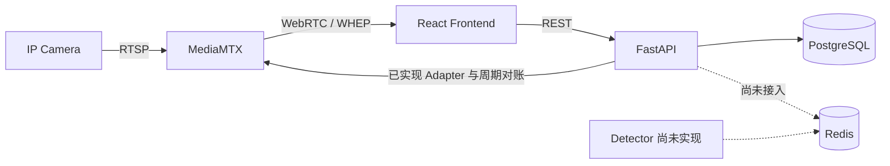

# SOP Vision

SOP Vision 是面向 IP Camera 的视觉分析平台。当前仓库已经完成可运行的基础设施、
FastAPI/React 工程骨架，以及 Camera 配置、MediaMTX 适配和后台媒体对账所需的公共能力；
Camera 创建、搜索分页列表、详情、完整编辑、默认源切换和 WHEP 播放已经可用，删除和 Detector
业务仍未实现。

## 当前状态

| 范围                | 状态     | 说明                                                                                    |
| ------------------- | -------- | --------------------------------------------------------------------------------------- |
| 本地运行栈          | 可用     | PostgreSQL、Redis、MediaMTX、FastAPI、React/Nginx                                       |
| Backend 公共基础    | 可用     | 应用工厂、数据库生命周期、统一日志、Problem、Trace ID、CORS                             |
| 健康检查            | 可用     | `GET /api/v1/health/live` 与 `GET /api/v1/health/ready`                                 |
| Cameras Foundation  | 已完成   | 领域聚合、Repository/UoW、关系模型、OpenAPI、前端 Client/Mock 和 CI 门禁                |
| MediaMTX 媒体边界   | 已完成   | v1.20.1 协议、Path 读写、完整快照、状态投影和真实 Adapter 门禁                          |
| 媒体后台对账        | 已完成   | 启动/周期恢复数据库 Source Path，并清理受管孤儿 Path                                    |
| Cameras HTTP 业务   | 部分可用 | 创建、列表、详情、完整更新和默认源切换可用；删除仍为唯一占位 handler                    |
| Web UI              | 部分可用 | 新增、搜索分页、实时预览、详情播放、临时切源、编辑和默认源切换可用；删除和 Tasks 未实现 |
| Detector 与实时检测 | 未实现   | `detector/` 仅为预留目录；Backend 尚未接入 Redis 客户端或 WebSocket                     |

精确的 Cameras 当前能力见 [Cameras 模块文档](docs/modules/cameras/README.md)，未完成工作见
[Cameras MVP 剩余计划](docs/plans/cameras-mvp/README.md)。

## 架构边界



- PostgreSQL 是持久化业务配置的事实源；Redis 预留给运行时状态和消息，不保存正式配置。
- MediaMTX 负责视频接入和浏览器媒体传输；FastAPI 不代理视频字节。
- FastAPI 是控制面。Frontend 不直接访问 PostgreSQL、Redis 或 MediaMTX Control API。
- Detector 应独立运行；其目标边界与尚未落地的链路见
  [总体架构](docs/vision-platform-architecture.md)。

## 仓库结构

```text
.
├── backend/              # FastAPI、SQLAlchemy、Alembic 和后端测试
├── contracts/            # 确定性生成并提交的 OpenAPI 契约
├── detector/             # Detector 预留目录，当前无实现
├── docs/                 # 架构、产品、Cameras MVP 与设计系统
├── frontend/             # React、TypeScript、Vite 和 Nginx 镜像
├── scripts/              # 按变更验证、跨端契约与专项门禁
├── tests/                # 仓库级测试基础设施回归测试
├── test-impact.json      # 路径、模块影响、验证级别和命令登记
├── compose.yaml          # 完整运行栈
├── compose.dev.yaml      # 宿主机开发所需的额外端口
└── .env.example
```

## 使用 Compose 运行

要求 Docker 与 Docker Compose。首次启动：

```bash
cp .env.example .env
docker compose --env-file .env config
docker compose --env-file .env up --build --wait
docker compose --env-file .env exec backend alembic upgrade head
```

访问地址：

- Frontend：<http://localhost:8000>
- OpenAPI UI：<http://localhost:3001/docs>
- Backend 存活检查：<http://localhost:3001/api/v1/health/live>
- MediaMTX WHEP 服务：<http://localhost:8889>

容器启动不会自动执行数据库迁移；部署新 revision 后必须显式运行 `alembic upgrade head`。
当前 Frontend 可以创建、搜索、分页浏览和编辑 Camera，Card 可以实时预览并切换默认 Source，详情页
可以播放 WHEP 流和临时切换 Source。Backend 除删除外的 Cameras 接口均已实现。

停止服务使用：

```bash
docker compose down
```

命名卷默认保留。只有明确需要删除本地 PostgreSQL/Redis 数据时才使用
`docker compose down --volumes`。

## 宿主机开发

要求 Python 3.12、uv、Node.js 24 和 pnpm 11。配置按运行位置拆分，容器服务名不能用于
宿主机进程：

```bash
cp .env.example .env
cp backend/.env.local.example backend/.env.local
cp frontend/.env.local.example frontend/.env.local

docker compose -f compose.yaml -f compose.dev.yaml \
  up -d --wait postgres redis mediamtx
```

安装依赖并迁移数据库：

```bash
cd backend
uv sync --locked
uv run --env-file .env.local alembic upgrade head

cd ../frontend
corepack enable
pnpm install --frozen-lockfile
```

分别启动 Backend 和 Frontend：

```bash
cd backend
uv run --env-file .env.local python -m app.server \
  --host 127.0.0.1 --port 3001 --reload

cd frontend
pnpm dev
```

配置变量、数据库测试和 MSW 场景分别见 [Backend README](backend/README.md) 与
[Frontend README](frontend/README.md)。

## 质量检查

```bash
./scripts/verify-changed.sh
```

脚本先检查全仓测试目录，再根据 `test-impact.json` 选择受影响模块和验证强度。Backend integration
被选中时必须通过 `backend/.env.local` 或进程环境提供独立 `TEST_DATABASE_URL`；缺少环境会失败，
不会把跳过当作通过。完整规则、日志位置和单项排障命令见
[测试基础设施](docs/modules/test-infrastructure/README.md)。

### 手动执行全量测试

需要排查按变更验证之外的问题时，可以分别执行前后端全量测试。Backend 测试前应先按“宿主机开发”
章节启动 PostgreSQL，并确保 `backend/.env.local` 同时配置了 `DATABASE_URL` 和独立的
`TEST_DATABASE_URL`。

Backend 的 unit、module、contract 和 integration 测试：

```bash
cd backend
uv run --env-file .env.local pytest
```

Frontend 的 unit、component、contract 和 integration 测试：

```bash
cd frontend
pnpm test
```

如需同时检查仓库级测试选择和目录规则，在仓库根目录执行：

```bash
python3 -m unittest discover \
  -s tests/unit/test_infrastructure \
  -p 'test_*.py'
```

## 文档

从 [文档入口](docs/README.md) 开始阅读。核心文档包括：

- [总体架构](docs/vision-platform-architecture.md)
- [产品范围](docs/product-requirements.md)
- [Cameras 当前能力](docs/modules/cameras/README.md)
- [Backend 日志](docs/modules/backend-logging/README.md)
- [测试基础设施](docs/modules/test-infrastructure/README.md)
- [Cameras MVP 剩余计划](docs/plans/cameras-mvp/README.md)
- [Design System](docs/design-system/README.md)
- [实时检测数据设计](docs/realtime-detection-design.md)
