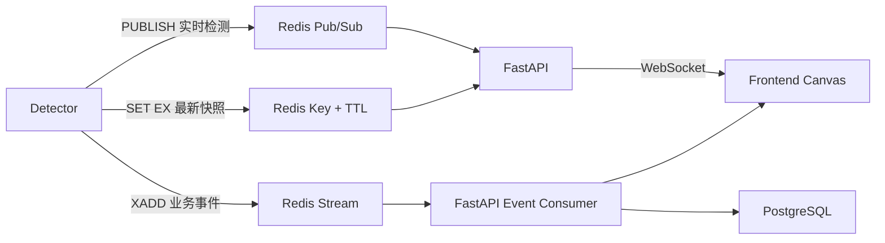

## 1. 结论

SOP Vision 不应使用单一 Redis 通信方式承载所有数据。推荐根据数据语义组合使用以下三种能力：

| 数据类型 | Redis 能力 | 使用原因 |
| --- | --- | --- |
| bbox、跟踪位置、实时人数、FPS | Pub/Sub | 延迟低；数据很快过期，偶尔丢失不影响业务 |
| 最新一帧检测结果、任务当前状态 | `SET` + TTL | 页面刚打开时可以立即读取快照；过期数据自动清理 |
| SOP 违规、告警等业务事件 | Redis Stream | 支持消息确认、重试及断线恢复 |
| 摄像头、检测任务、算法配置 | 不使用 Redis 作为唯一存储 | 此类数据应持久化到 PostgreSQL |

因此，“FastAPI 是否通过 Redis Pub/Sub 获取 Detector 的检测数据”的答案是：

> 高频实时检测数据使用 Pub/Sub，但不能把所有数据都放进 Pub/Sub。最新快照使用带 TTL 的 Key，需要可靠处理的业务事件使用 Redis Stream。

推荐的整体数据流如下：



## 2. Redis 在本项目中的角色

Redis 是一个独立服务，不是 FastAPI 的插件，也不是 Python 进程内的变量。Detector 和 FastAPI 分别连接同一个 Redis 服务：

```text
Detector  ----\
               >---- Redis
FastAPI   ----/
```

Detector 负责生产检测数据，FastAPI 负责消费和聚合检测数据，浏览器不直接连接 Redis：

```text
Detector → Redis → FastAPI → WebSocket → Browser
```

前端视频仍然由 MediaMTX 提供，不经过 Redis 或 FastAPI：

```text
MediaMTX → WebRTC/WHEP → Browser <video>
```

最终浏览器将两条数据链路组合起来：

```text
<video>  播放 MediaMTX 提供的视频
<canvas> 绘制 FastAPI WebSocket 提供的 bbox、ROI 和状态文字
```

不要通过 Redis 传输原始视频帧、JPEG 图片或完整视频流。Redis 只传递检测元数据。

## 3. Pub/Sub 的基本概念

Pub/Sub 是 Publish/Subscribe，即发布/订阅。

Detector 向频道发布消息：

```text
PUBLISH vision:telemetry:task_001 "{...json...}"
```

FastAPI 订阅频道：

```text
SUBSCRIBE vision:telemetry:task_001
```

当 Detector 发布消息时，Redis 会立即把消息推给当前在线的所有订阅者。

### 3.1 Pub/Sub 不保存消息

如果 FastAPI 在消息发布时没有连接 Redis，这条消息就会丢失。FastAPI 重连后无法要求 Redis 重新发送之前的 Pub/Sub 消息。

这种语义很适合实时 bbox。假设 Detector 每秒发布 10 次检测结果，丢失第 51 个结果并不重要，因为约 100 毫秒后第 52 个结果就会到达。

以下数据适合 Pub/Sub：

- bbox。
- track 坐标。
- 当前人数。
- FPS。
- 推理耗时。
- GPU 使用率。
- 页面上实时显示但不需要回放的数据。

以下数据不适合只使用 Pub/Sub：

- SOP 违规。
- 安全告警。
- 洗手完成事件。
- 越界事件。
- 需要持久化、审计或生成证据的数据。

## 4. 按检测任务设计频道

本项目的产品模型允许同一个 `CameraSource` 绑定多个 `DetectionTask`：

```text
CameraSource 1 ── N DetectionTask
```

例如，同一个摄像头源可能同时运行：

- 人员检测算法。
- 安全帽检测算法。
- 越界检测算法。

因此，实时检测频道推荐按 `task_id` 划分：

```text
vision:telemetry:{task_id}
```

示例：

```text
vision:telemetry:task_person_001
vision:telemetry:task_helmet_001
vision:telemetry:task_intrusion_001
```

如果只使用 `camera_id` 作为频道，同一摄像头的多个算法结果会混合在一起，FastAPI 和前端还需要再次分流。使用 `task_id` 更符合当前 Detection Task 的业务边界。

消息中仍应携带完整关联信息，以便校验、追踪和排错。

## 5. 检测消息协议

推荐的实时检测消息如下：

```json
{
  "schema_version": 1,
  "type": "frame_detection",
  "task_id": "task_helmet_001",
  "camera_id": "cam_001",
  "source_id": "source_101",
  "algorithm_id": "helmet_detection",
  "algorithm_version": "1.2.0",
  "frame_id": 18272,
  "frame_ts_ms": 1786501200123,
  "published_at_ms": 1786501200180,
  "source_width": 1920,
  "source_height": 1080,
  "objects": [
    {
      "track_id": 12,
      "class_name": "person",
      "confidence": 0.96,
      "bbox": [0.21, 0.11, 0.48, 0.91],
      "attributes": {
        "helmet": false
      }
    }
  ],
  "metrics": {
    "inference_ms": 18.4,
    "fps": 24.7
  }
}
```

### 5.1 必须保留的字段

建议至少包含：

- `schema_version`：消息协议版本，便于以后升级。
- `task_id`：消息所属检测任务，也是频道路由依据。
- `camera_id`：物理摄像头标识。
- `source_id`：摄像头视频源标识。
- `algorithm_id`：算法标识。
- `frame_id`：Detector 内部单调递增的帧编号。
- `frame_ts_ms`：原始帧时间戳，使用 UTC Unix 毫秒。
- `published_at_ms`：发布到 Redis 前的时间戳，用于测量数据链路延迟。
- `source_width`、`source_height`：原始画面尺寸。
- `objects`：目标检测结果。

### 5.2 bbox 使用归一化坐标

推荐使用：

```text
[x1, y1, x2, y2]
```

四个数值都在 `[0, 1]` 范围内。例如：

```json
"bbox": [0.21, 0.11, 0.48, 0.91]
```

归一化坐标不依赖前端当前显示分辨率。前端绘制时：

```javascript
const x1 = bbox[0] * canvas.width;
const y1 = bbox[1] * canvas.height;
const x2 = bbox[2] * canvas.width;
const y2 = bbox[3] * canvas.height;
```

## 6. Redis Key、Channel 和 Stream 命名

建议统一采用 `vision` 前缀：

```text
# 实时检测频道
vision:telemetry:{task_id}

# 最新检测结果，建议 TTL 为 5 秒
vision:task:{task_id}:latest

# 检测任务运行状态
vision:task:{task_id}:runtime

# Detector 心跳，建议 TTL 为 10 秒
vision:worker:{worker_id}:heartbeat

# 可靠业务事件 Stream
vision:events
```

Detector 每次发布实时结果时，同时执行：

```text
SET vision:task:task_001:latest "{JSON}" EX 5
PUBLISH vision:telemetry:task_001 "{JSON}"
```

两条命令的作用不同：

- `PUBLISH` 将结果实时推送给在线的 FastAPI。
- `SET ... EX 5` 保存最近一次结果，5 秒后自动过期。
- 页面刚打开时可以先读取 latest Key，不必等待 Detector 产生下一次结果。
- Detector 停止后 Key 自动过期，避免页面长期展示陈旧数据。

## 7. Detector Demo 的 ROI 配置通道

当前 `algorithm` 目录中的第一版 detector demo 为了保持轻量，ROI 更新暂时只使用 Redis Pub/Sub：

```text
ROI publisher
    │ PUBLISH vision:config:roi:detector-demo
    ▼
Redis
    │ SUBSCRIBE
    ▼
Detector ROI state
```

消息格式：

```json
{
  "schema_version": 1,
  "type": "roi_update",
  "task_id": "detector-demo",
  "roi_id": "main",
  "enabled": true,
  "points": [[0.1, 0.1], [0.9, 0.1], [0.9, 0.9], [0.1, 0.9]]
}
```

- `points` 使用 `[0, 1]` 归一化坐标，至少三个点。
- Detector 对整帧执行 YOLO，仅保留 bbox 中心点在多边形内部或边界上的目标。
- `enabled=false` 且 `points=[]` 表示清除 ROI、恢复全画面检测。
- 非法消息不会覆盖当前合法 ROI。
- 此 demo 不保存 ROI 最新值。Detector 重启、Redis 断线或订阅尚未建立时发布的消息都会丢失，启动后需重新发布。

这只是 demo 控制通道。正式平台仍应以 PostgreSQL 保存 Desired State，并通过版本化配置协调 Worker；不要将易失性的 Pub/Sub 当作 ROI 的唯一持久化来源。
