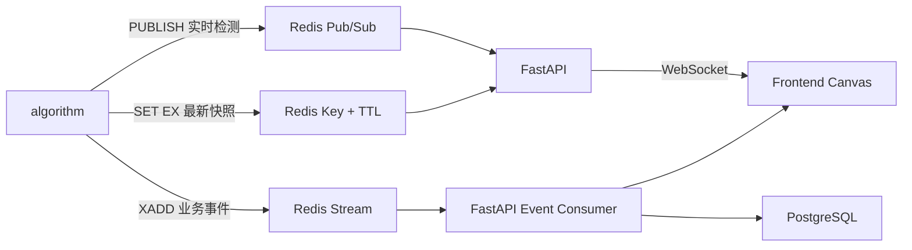

## 1. 结论

SOP Vision 不应使用单一 Redis 通信方式承载所有数据。推荐根据数据语义组合使用以下三种能力：

| 数据类型 | Redis 能力 | 使用原因 |
| --- | --- | --- |
| bbox、跟踪位置、实时人数、FPS | Pub/Sub | 延迟低；数据很快过期，偶尔丢失不影响业务 |
| 最新一帧检测结果、任务当前状态 | `SET` + TTL | 页面刚打开时可以立即读取快照；过期数据自动清理 |
| SOP 违规、告警等业务事件 | Redis Stream | 支持消息确认、重试及断线恢复 |
| 摄像头、检测任务、算法配置 | 不使用 Redis 作为唯一存储 | 此类数据应持久化到 PostgreSQL |

因此，“FastAPI 是否通过 Redis Pub/Sub 获取 algorithm 的检测数据”的答案是：

> 高频实时检测数据使用 Pub/Sub，但不能把所有数据都放进 Pub/Sub。最新快照使用带 TTL 的 Key，需要可靠处理的业务事件使用 Redis Stream。

推荐的整体数据流如下：



## 2. Redis 在本项目中的角色

Redis 是一个独立服务，不是 FastAPI 的插件，也不是 Python 进程内的变量。algorithm 和 FastAPI 分别连接同一个 Redis 服务：

```text
algorithm  ----\
               >---- Redis
FastAPI   ----/
```

algorithm 负责生产检测数据，FastAPI 负责消费和聚合检测数据，浏览器不直接连接 Redis：

```text
algorithm → Redis → FastAPI → WebSocket → Browser
```

前端视频仍然由 MediaMTX 提供，不经过 Redis 或 FastAPI：

```text
MediaMTX → WebRTC/WHEP → Browser <video>
```

最终浏览器将两条数据链路组合起来：

```text
<video>  播放 MediaMTX 提供的视频
<canvas> 绘制 FastAPI WebSocket 提供的 bbox、ROI 和状态文字
```

不要通过 Redis 传输原始视频帧、JPEG 图片或完整视频流。Redis 只传递检测元数据。

### 2.1 本地 Qt Viewer 演示链路

仓库中的 Qt Viewer 是一个独立联调工具，可以绕过 FastAPI，直接组合 RTSP 和 Redis：

```text
MediaMTX ──RTSP──────────────────> Qt Viewer 当前视频帧
AIWorker ──Redis Pub/Sub/latest──> Qt Viewer 最新检测结果
```

- AIWorker 仍直接向 Redis 发布结果，Algorithm Daemon 不参与数据转发。
- Viewer 先确认订阅实时频道，再读取 latest Key，减少启动窗口丢消息。
- Viewer 只展示最近 2 秒内的最新结果；空结果、结果超时或 Redis 断线都会清框。
- Viewer 的 RTSP 会话与 AIWorker 相互独立，当前版本不使用 RTP、RTCP 或 PTS 做同帧
  匹配，也不缓存历史帧。
- 因此检测框可能因两个 RTSP 会话、推理和 Redis 传输延迟而偏离当前画面。该 Viewer
  只用于验证数据链路和绘制效果，不能作为逐帧同步验收依据。

## 3. Pub/Sub 的基本概念

Pub/Sub 是 Publish/Subscribe，即发布/订阅。

algorithm 向频道发布消息：

```text
PUBLISH vision:telemetry:task_001 "{...json...}"
```

FastAPI 订阅频道：

```text
SUBSCRIBE vision:telemetry:task_001
```

当 algorithm 发布消息时，Redis 会立即把消息推给当前在线的所有订阅者。

### 3.1 Pub/Sub 不保存消息

如果 FastAPI 在消息发布时没有连接 Redis，这条消息就会丢失。FastAPI 重连后无法要求 Redis 重新发送之前的 Pub/Sub 消息。

这种语义很适合实时 bbox。假设 algorithm 每秒发布 10 次检测结果，丢失第 51 个结果并不重要，因为约 100 毫秒后第 52 个结果就会到达。

以下数据适合 Pub/Sub：

- bbox。
- track 坐标。
- 当前人数。
- FPS。
- 推理耗时。
- GPU 使用率。
- 页面上实时显示但不需要回放的数据。

以下数据不适合只使用 Pub/Sub：

- SOP 违规。
- 安全告警。
- 洗手完成事件。
- 越界事件。
- 需要持久化、审计或生成证据的数据。

## 4. 按检测任务设计频道

本项目的产品模型允许同一个 `CameraSource` 绑定多个 `DetectionTask`：

```text
CameraSource 1 ── N DetectionTask
```

例如，同一个摄像头源可能同时运行：

- 人员检测算法。
- 安全帽检测算法。
- 越界检测算法。

因此，实时检测频道推荐按 `task_id` 划分：

```text
vision:telemetry:{task_id}
```

示例：

```text
vision:telemetry:task_person_001
vision:telemetry:task_helmet_001
vision:telemetry:task_intrusion_001
```

`task_id` 同时标识外部任务与 Redis 路由边界。摄像头、视频源和算法身份不再作为
Detector 配置或消息字段；需要这类业务元数据时，应由上层系统按 `task_id` 关联。

## 5. 检测消息协议

推荐的实时检测消息如下：

```json
{
  "schema_version": 2,
  "type": "frame_detection",
  "task_id": "task_helmet_001",
  "run_id": "54a81572-94a1-4bd5-a39f-f4ff06ef587a",
  "frame_id": 18272,
  "frame_ts_ms": 1786501200123,
  "published_at_ms": 1786501200180,
  "source_width": 1920,
  "source_height": 1080,
  "objects": [
    {
      "class_id": 0,
      "track_id": 12,
      "class_name": "person",
      "confidence": 0.96,
      "bbox": [0.21, 0.11, 0.48, 0.91],
      "attributes": {
        "helmet": false
      }
    }
  ],
  "metrics": {
    "inference_ms": 18.4,
    "fps": 24.7
  }
}
```

### 5.1 必须保留的字段

建议至少包含：

- `schema_version`：消息协议版本，便于以后升级。
- `task_id`：消息所属检测任务，也是频道路由依据。
- `run_id`：每次 Worker 进程启动生成的 UUID，与 `frame_id` 一起区分重启前后的帧。
- `frame_id`：algorithm 内部单调递增的帧编号。
- `frame_ts_ms`：Worker 的 OpenCV 解码器返回该帧后的本机 UTC Unix 毫秒时间；不是
  摄像机采集时间或 RTSP/RTP PTS。
- `published_at_ms`：推理完成并构建 Redis 消息时的本机 UTC Unix 毫秒时间。
- `frame_id` 与 `run_id` 组合标识 Worker 的一次运行；独立 RTSP 客户端不能用它匹配
  自己解码的视频帧。
- `source_width`、`source_height`：原始画面尺寸。
- `objects`：目标检测结果。

### 5.2 bbox 使用归一化坐标

推荐使用：

```text
[x1, y1, x2, y2]
```

四个数值都在 `[0, 1]` 范围内。例如：

```json
"bbox": [0.21, 0.11, 0.48, 0.91]
```

归一化坐标不依赖前端当前显示分辨率。前端绘制时：

```javascript
const x1 = bbox[0] * canvas.width;
const y1 = bbox[1] * canvas.height;
const x2 = bbox[2] * canvas.width;
const y2 = bbox[3] * canvas.height;
```

## 6. Redis Key、Channel 和 Stream 命名

建议统一采用 `vision` 前缀：

```text
# 实时检测频道
vision:telemetry:{task_id}

# 最新检测结果，建议 TTL 为 5 秒
vision:task:{task_id}:latest

# 检测任务运行状态
vision:task:{task_id}:runtime

# algorithm 心跳，建议 TTL 为 10 秒
vision:worker:{worker_id}:heartbeat

# 可靠业务事件 Stream
vision:events
```

algorithm 每次发布实时结果时，同时执行：

```text
SET vision:task:task_001:latest "{JSON}" EX 5
PUBLISH vision:telemetry:task_001 "{JSON}"
```

两条命令的作用不同：

- `PUBLISH` 将结果实时推送给在线的 FastAPI。
- `SET ... EX 5` 保存最近一次结果，5 秒后自动过期。
- 页面刚打开时可以先读取 latest Key，不必等待 algorithm 产生下一次结果。
- algorithm 停止后 Key 自动过期，避免页面长期展示陈旧数据。

## 7. PostgreSQL 配置与 ROI 数据流

算法参数和 ROI 不经过 Redis，也不由 Worker 控制接口传入。外部客户端先根据 Daemon
公开的 JSON Schema 生成配置，再把任务参数保存到 PostgreSQL：

```text
Qt / 平台客户端 ──UPSERT──> worker_task_parameters
        │                         │
        └────start/reload────────> Algorithm Daemon
                                  │ 读取、完整校验并启动
                                  ▼
                               AIWorker
```

单个任务的 ROI 配置示例：

```json
{
  "roi_id": "main",
  "points": [[0.1, 0.1], [0.9, 0.1], [0.9, 0.9], [0.1, 0.9]]
}
```

- `points` 使用 `[0, 1]` 归一化坐标，至少三个不重复点且多边形面积非零。
- `roi=null` 表示全画面检测。
- Worker 启动时在第一帧前应用 ROI，不存在先按全画面检测的过渡窗口。
- 修改 ROI 后调用该任务的 `reload`；守护进程先验证数据库新配置，再替换旧 Worker。
- Algorithm Daemon 的外部控制接口只接受 task ID 和空命令，不接收算法参数或 ROI。
- Redis 不再存在 `vision:config:roi:*` 频道，只负责检测结果数据面。
