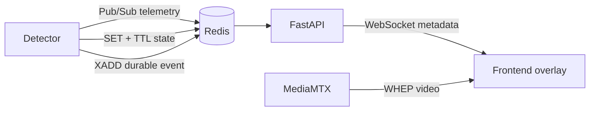

# 实时检测数据设计

> 状态：目标设计，尚未实现。

Compose 已提供 Redis 服务和 `REDIS_URL`，但 Backend 当前没有 Redis Settings、Client、消费者
或 WebSocket；`detector/` 也没有实现。本文只冻结有长期价值的通信语义，不能作为当前 API
使用说明。

## 数据通道

不同数据按可靠性和时效性选择不同 Redis 能力：

| 数据                         | 通道                    | 处理原则                                     |
| ---------------------------- | ----------------------- | -------------------------------------------- |
| 高频检测结果、bbox、FPS      | Pub/Sub                 | 旧帧价值低；慢消费者丢旧数据，不形成无界队列 |
| 最新检测快照、任务状态、心跳 | Key + TTL               | 新连接可立即读取；超时后自动视为过期         |
| 违规、完成、告警等业务事件   | Stream + Consumer Group | 需要 ACK、重试、Pending 监控和幂等落库       |

PostgreSQL 继续保存正式配置和需要长期保留的业务事件。Redis AOF 可以改善本地恢复，但不能把
Pub/Sub 变成可靠队列，也不能替代 PostgreSQL 的事务和查询能力。

## 目标数据流



Detector 的推理主循环不能同步等待 Redis。推理结果进入有界内存队列，由异步 Publisher 批量或
限频发布；队列满时 telemetry 丢弃旧帧，durable event 则进入独立可靠路径。

## 命名约定

Detection Task 是算法结果的业务隔离单位，推荐使用：

```text
vision:telemetry:{task_id}          # Pub/Sub
vision:task:{task_id}:latest        # Key，短 TTL
vision:task:{task_id}:runtime       # Key，短 TTL
vision:detector:{detector_id}:heartbeat
vision:events                       # Stream
```

只用 `camera_id` 会混合同一路 Source 上多个 Algorithm 的结果。Channel/Key 中的 ID 必须使用
持久化稳定标识，不能使用展示名称。

## Telemetry 公共字段

正式 schema 尚未生成；至少需要以下与算法无关的字段：

```json
{
  "schema_version": 1,
  "task_id": "task UUID",
  "camera_id": "camera UUID",
  "source_id": "source UUID",
  "frame_id": 18272,
  "frame_ts": "2026-08-26T10:00:00.123Z",
  "published_at": "2026-08-26T10:00:00.160Z",
  "source_width": 1920,
  "source_height": 1080,
  "detections": [
    {
      "track_id": "12",
      "class_name": "person",
      "confidence": 0.96,
      "bbox": [0.21, 0.11, 0.48, 0.91]
    }
  ]
}
```

- `bbox` 使用 `[x_min, y_min, x_max, y_max]` 的 `[0, 1]` 归一化坐标。
- `frame_id` 与 `frame_ts` 用于去重、乱序判断和后续视频同步。
- `schema_version` 必须支持消费者拒绝未知的不兼容协议，不能在运行时猜字段。
- Algorithm 扩展字段应位于独立命名空间，不能改变公共字段语义。
- 消息不得包含 Camera 凭据、完整 RTSP URL 或原始内部异常。

具体 UUID、时间格式、最大消息大小、发布频率和算法扩展 schema 必须在实现前通过正式契约
冻结；上面的示例不等同于已发布 API。

## FastAPI Gateway 边界

目标 Gateway 负责：

- 在 lifespan 中创建和关闭共享 Redis 连接。
- 按本进程 WebSocket 订阅集合复用 Redis subscription，而非每个浏览器建立一个 Redis Client。
- 连接建立时读取 latest key，再订阅后续 telemetry，减少首屏空窗。
- 校验 schema、授权 task、过滤过期/重复消息，并把稳定公共消息推送给浏览器。
- 浏览器断开后释放订阅；无本地订阅者时停止对应 Redis subscription。

浏览器不得直接连接 Redis。FastAPI 多实例时，每个实例接收 Pub/Sub 副本，只向本机连接推送；
可靠事件使用 Consumer Group 分摊，二者不能共用消费模型。

## 背压与时效

- Detector Publisher、FastAPI fan-out 和每个 WebSocket 都使用有界队列。
- Telemetry 优先保留最新帧；慢客户端不能拖慢其他客户端或积压历史帧。
- 状态和心跳使用 TTL，消费者根据服务端时间判断过期；跨节点部署需要时钟同步。
- Frontend 使用 `frame_id`/`frame_ts` 去重，不把每帧数据写入全局持久化状态。
- 视频与 metadata 经不同链路到达，第一版允许小幅 overlay 延迟；只有实测需要时才引入
  jitter buffer 或更复杂同步。

## 可靠事件

Stream 消费至少需要：

- 稳定 `event_id` 和业务幂等键。
- 成功持久化后 ACK；失败保留 Pending 并按策略重试。
- Pending 数量、最老消息年龄、重试和死信可观测。
- PostgreSQL 唯一约束保证重复消费不产生重复业务记录。

Redis Stream 提供 at-least-once 基础，不提供 exactly-once。没有幂等落库与恢复流程时，不得把
关键业务结果描述为“可靠”。

## 故障与安全

| 故障           | 目标行为                                                    |
| -------------- | ----------------------------------------------------------- |
| Redis 不可用   | Detector 推理继续；实时推送降级；Publisher 按边界丢弃或缓冲 |
| FastAPI 重启   | Detector 不受影响；浏览器重连并先读取 latest 快照           |
| 浏览器慢或断开 | 只影响该连接；清理队列和订阅引用                            |
| Detector 停止  | 心跳/状态 TTL 过期，不能永久展示最后状态                    |

Redis 与 WebSocket 必须位于受控网络；订阅 task 前执行鉴权和资源授权；限制连接数、消息大小、
发送速率和 Origin。日志与指标只记录稳定 ID、计数、延迟和错误 code，不记录检测原图、凭据或
完整消息体。

## 实现前未决项

1. Telemetry、runtime state 和 durable event 的正式 schema 与兼容策略。
2. 目标发布频率、端到端延迟、TTL、队列容量和丢帧指标。
3. WebSocket 鉴权、重连协议、心跳和客户端订阅 API。
4. Stream 重试上限、死信策略、事件保留和 PostgreSQL 数据模型。
5. 多 Backend/Detector 实例的 ownership、部署容量和压测基线。
