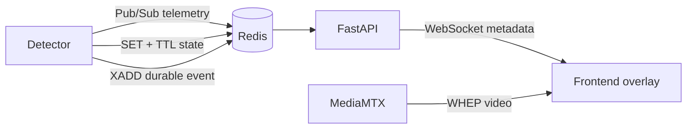

# 实时检测数据设计

> 状态：目标设计，尚未实现。

Compose 已提供 Redis 服务和 `REDIS_URL`，但 Backend 当前没有 Redis Settings、Client、消费者
或 WebSocket；`detector/` 也没有实现。本文只冻结有长期价值的通信语义，不能作为当前 API
使用说明。

## 数据通道

不同数据按可靠性和时效性选择不同 Redis 能力：

| 数据                         | 通道                    | 处理原则                                     |
| ---------------------------- | ----------------------- | -------------------------------------------- |
| 高频检测结果、bbox、FPS      | Pub/Sub                 | 旧帧价值低；慢消费者丢旧数据，不形成无界队列 |
| 最新检测快照、任务状态、心跳 | Key + TTL               | 新连接可立即读取；超时后自动视为过期         |
| 违规、完成、告警等业务事件   | Stream + Consumer Group | 需要 ACK、重试、Pending 监控和幂等落库       |

PostgreSQL 继续保存正式配置和需要长期保留的业务事件。Redis AOF 可以改善本地恢复，但不能把
Pub/Sub 变成可靠队列，也不能替代 PostgreSQL 的事务和查询能力。

## 目标数据流



Detector 的推理主循环不能同步等待 Redis。推理结果进入有界内存队列，由异步 Publisher 批量或
限频发布；队列满时 telemetry 丢弃旧帧，durable event 则进入独立可靠路径。

## 命名约定

Detection Task 是算法结果的业务隔离单位，推荐使用：

```text
vision:telemetry:{task_id}          # Pub/Sub
vision:task:{task_id}:latest        # Key，短 TTL
vision:task:{task_id}:runtime       # Key，短 TTL
vision:detector:{detector_id}:heartbeat
vision:events                       # Stream
```

只用 `camera_id` 会混合同一路 Source 上多个 Algorithm 的结果。Channel/Key 中的 ID 必须使用
持久化稳定标识，不能使用展示名称。

## DetectionResult 与坐标

正式 WebSocket schema 尚未生成。传输层至少需要以下与算法无关的字段，Frontend Client 校验后再
转换成 camelCase 的 `DetectionResult`，业务组件不依赖 WebSocket 消息格式：

```json
{
  "schema_version": 1,
  "task_id": "task UUID",
  "camera_id": "camera UUID",
  "source_id": "source UUID",
  "frame_id": 18272,
  "rtp_timestamp": 3912740032,
  "capture_timestamp": 1787738400123.25,
  "unix_timestamp_ms": 1787738400123,
  "published_at": "2026-08-26T10:00:00.160Z",
  "source_width": 1920,
  "source_height": 1080,
  "boxes": [
    {
      "track_id": "12",
      "label": "person",
      "confidence": 0.96,
      "x": 0.21,
      "y": 0.11,
      "width": 0.27,
      "height": 0.8
    }
  ]
}
```

- `x/y/width/height` 使用源视频左上角为原点的 `[0, 1]` 归一化坐标；服务端不根据 Card、Detail、
  浏览器窗口或 CSS `object-fit` 返回像素坐标。
- `frame_id` 用于同一 Task 内去重和乱序判断。`rtp_timestamp` 是首选视频匹配键，但只有 Detector
  与浏览器 WHEP 帧使用同一 RTP 时钟域且正确处理 32 位回绕时才能启用。
- `capture_timestamp` 和 `unix_timestamp_ms` 的单位、时钟来源与误差预算必须进入正式 schema；不能
  只给一个没有时钟含义的数字。
- `schema_version` 必须支持消费者拒绝未知的不兼容协议，不能在运行时猜字段。
- Algorithm 扩展字段应位于独立命名空间，不能改变公共字段语义。
- 消息不得包含 Camera 凭据、完整 RTSP URL 或原始内部异常。

Frontend 内部公共类型使用：

```ts
interface DetectionBox {
  x: number;
  y: number;
  width: number;
  height: number;
  label?: string;
  confidence?: number;
  trackId?: string;
}

interface DetectionResult {
  taskId: string;
  sourceId: string;
  frameId: number;
  rtpTimestamp?: number;
  captureTimestamp?: number;
  unixTimestampMs?: number;
  receivedAt: number;
  boxes: DetectionBox[];
}
```

Keypoint、Track 轨迹和 Algorithm 扩展结果沿用归一化源坐标，但使用各自明确类型，不能把不同形状
塞进 `DetectionBox` 的可选字段。具体 UUID、时间单位、最大消息大小、发布频率和扩展 schema 必须
在实现前冻结；上面的示例不等同于已发布 API。

## Frontend 播放与 Overlay 边界

Detection Task 复用 [WHEP 浏览器播放](modules/cameras/whep-player.md)已经提供的 `WhepSession`、
`StreamSessionManager` 和 `VideoSurface`。
同一路 Source 的 Card、Camera Detail 与 Task Detail 共享 `MediaStream`，但每个消费者有独立的
`<video>`、`<canvas>` 和 HTML overlay。

```text
VideoSurface
├── video                 浏览器直接渲染媒体
├── BoxCanvas             只绘制 Box、Label、Keypoint、Track
└── HTML overlay          控件、LIVE、连接和业务状态
```

Detection 阶段把 `BoxCanvas` 作为 React child 组合到 `VideoSurface`，并通过 video feature 的受控
Context 读取 video 元素和通用测量值；video feature 不导入 Detection 类型：

- Context 使用 `ResizeObserver`、`video.videoWidth/video.videoHeight`、容器尺寸和 `object-fit` 计算
  媒体实际显示矩形；`contain` 处理留白，`cover` 处理裁剪。
- Canvas CSS 尺寸跟随容器，绘图缓冲区按 `devicePixelRatio` 缩放，避免高 DPI 模糊。
- 坐标转换只属于 Detection 的 `BoxCanvas`；Backend 不知道 Card 或 Detail 的像素尺寸。
- 普通状态和 controls 使用 HTML，Canvas 不重绘整个视频，也不承担点击按钮或可访问文本。

推荐目录：

```text
frontend/src/features/detection/
├── api/detection-socket.ts
├── model/detection-result.ts
├── sync/box-buffer.ts
├── hooks/use-video-synced-boxes.ts
├── components/box-canvas.tsx
└── testing/fakes.ts
```

## BoxBuffer 与视频帧同步

WebSocket Client 只负责校验、转换和重连，结果进入每个 Task 消费者自己的 `BoxBuffer`。业务组件
不读取 WebSocket 原始消息；未来改用 DataChannel 时仍产出同一个 `DetectionResult`，并且必须携带
可与视频帧关联的时间戳，不能依赖消息到达顺序。

`VideoSurface` 使用 `video.requestVideoFrameCallback()` 驱动查找与绘制，并在卸载或 Stream 变化时
调用 `cancelVideoFrameCallback()`。匹配优先级为：

```text
同一时钟域的 RTP Timestamp
> 同一时钟基准的 Capture Timestamp
> Unix Timestamp
> receivedAt
```

`BoxBuffer` 负责按时间排序、去重、在允许窗口内返回最近结果、清理过期结果和限制最大容量。窗口、
过期时间与容量通过真实发布频率和延迟测量确定，不能使用固定 `setTimeout(200ms)` 补偿 AI 或网络
延迟，也不能用 `setInterval + video.currentTime` 作为主要同步机制。

默认策略是视频优先：视频继续实时播放，当前视频帧只绘制时间窗口内可匹配的结果；没有结果时清空
旧 Box，不能让上一帧标注长期停留。第一版不强制延迟视频。只有业务确认严格同步且实测证明需要时，
才为播放器增加可配置 `syncDelayMs`，建议评估范围为 `200–500ms`。

## FastAPI Gateway 边界

目标 Gateway 负责：

- 在 lifespan 中创建和关闭共享 Redis 连接。
- 按本进程 WebSocket 订阅集合复用 Redis subscription，而非每个浏览器建立一个 Redis Client。
- 连接建立时读取 latest key，再订阅后续 telemetry，减少首屏空窗。
- 校验 schema、授权 task、过滤过期/重复消息，并把稳定公共消息推送给浏览器。
- 浏览器断开后释放订阅；无本地订阅者时停止对应 Redis subscription。

浏览器不得直接连接 Redis。FastAPI 多实例时，每个实例接收 Pub/Sub 副本，只向本机连接推送；
可靠事件使用 Consumer Group 分摊，二者不能共用消费模型。

## 背压与时效

- Detector Publisher、FastAPI fan-out 和每个 WebSocket 都使用有界队列。
- Telemetry 优先保留最新帧；慢客户端不能拖慢其他客户端或积压历史帧。
- 状态和心跳使用 TTL，消费者根据服务端时间判断过期；跨节点部署需要时钟同步。
- Frontend 使用 `frame_id` 和可用时间戳去重，不把每帧数据写入全局持久化状态。
- 视频与 metadata 经不同链路到达，第一版采用视频优先；只有实测需要时才引入可配置同步延迟。

## 可靠事件

Stream 消费至少需要：

- 稳定 `event_id` 和业务幂等键。
- 成功持久化后 ACK；失败保留 Pending 并按策略重试。
- Pending 数量、最老消息年龄、重试和死信可观测。
- PostgreSQL 唯一约束保证重复消费不产生重复业务记录。

Redis Stream 提供 at-least-once 基础，不提供 exactly-once。没有幂等落库与恢复流程时，不得把
关键业务结果描述为“可靠”。

## 故障与安全

| 故障           | 目标行为                                                    |
| -------------- | ----------------------------------------------------------- |
| Redis 不可用   | Detector 推理继续；实时推送降级；Publisher 按边界丢弃或缓冲 |
| FastAPI 重启   | Detector 不受影响；浏览器重连并先读取 latest 快照           |
| 浏览器慢或断开 | 只影响该连接；清理队列和订阅引用                            |
| Detector 停止  | 心跳/状态 TTL 过期，不能永久展示最后状态                    |

Redis 与 WebSocket 必须位于受控网络；订阅 task 前执行鉴权和资源授权；限制连接数、消息大小、
发送速率和 Origin。日志与指标只记录稳定 ID、计数、延迟和错误 code，不记录检测原图、凭据或
完整消息体。

## 实现前未决项

1. Detector 输出与 MediaMTX WHEP 帧是否保留同一 RTP timestamp/clock rate，以及回绕测试方法；不满足
   时必须固定 Capture/Unix timestamp 的同钟方案。
2. Telemetry、runtime state 和 durable event 的正式 schema、时间单位与兼容策略。
3. Box 最近帧匹配窗口、过期时间、发布频率、端到端延迟、TTL、队列容量和丢帧指标。
4. WebSocket 鉴权、重连协议、心跳和客户端订阅 API。
5. Stream 重试上限、死信策略、事件保留和 PostgreSQL 数据模型。
6. 多 Backend/Detector 实例的 ownership、部署容量和压测基线。

## 与当前实现的关系

- 共享 `WhepSession`、`StreamSessionManager`、`VideoSurface` 和 Camera Detail controls 已实现，可作为
  Detection 视频和 Overlay 的前置能力。
- Camera Card 播放属于独立的 [Cameras 08 计划](plans/cameras-mvp/08-camera-list/README.md)，不由
  Detection 实现提前承担。
- Detector、Redis Client、WebSocket、`DetectionResult`、`BoxBuffer` 和 `BoxCanvas` 均未实现。
  Detection 正式开发前应针对上面的 schema、WebSocket、时钟和容量未决项建立新的执行计划。
- WebRTC Stats 仍是后续能力。实现时应在 `WhepSession` 内提供受控 `getStats()`，按 `1–2s` 采样
  FPS、Bitrate、Packet Loss、Jitter、RTT 和 Connection State；不能每帧调用，也不能让 React 读取
  reader 私有字段。
