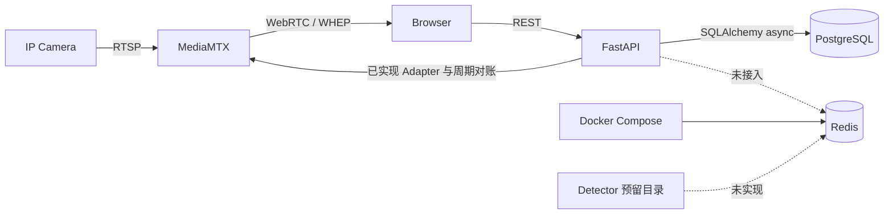
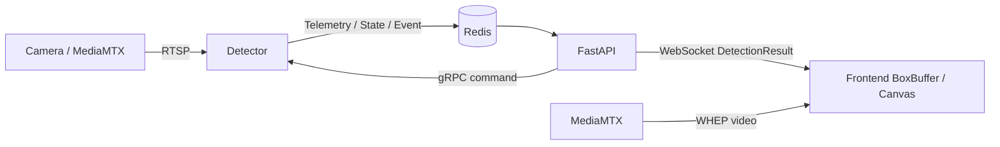

# SOP Vision 总体架构

本文同时说明当前已经存在的系统边界和后续目标架构。标记为“目标”的组件或链路不能视为
当前能力；实现进度以 [文档入口](README.md) 和代码为准。

## 架构原则

> MediaMTX 负责视频，FastAPI 负责控制与业务，Detector 负责算法；PostgreSQL 保存持久化
> Desired State，Redis 承担运行时 Actual State 与消息。

- 视频和业务 metadata 分离。浏览器直接从 MediaMTX 获取 WHEP 媒体，FastAPI 不转发视频字节。
- Frontend 只访问公共 Backend API 和公开媒体地址，不访问 Control API、数据库或 Redis。
- 持久化配置不能只存在于 MediaMTX 或 Redis；外部运行时状态失败不应破坏已提交配置。
- Detector 生命周期独立于 FastAPI。外围控制面短暂不可用时，正在运行的算法应尽可能继续。
- Command、Event、Telemetry 和 State 使用不同通信语义，不用一种队列替代所有通道。

## 当前运行架构



| 组件       | 当前实现                                                                 | 当前限制                                                |
| ---------- | ------------------------------------------------------------------------ | ------------------------------------------------------- |
| PostgreSQL | Compose 服务、连接池、迁移、Camera 关系模型、创建、列表与详情读取        | 更新和删除 handler 尚未写入聚合                         |
| Redis      | Compose 服务、AOF 与健康检查                                             | Backend Settings/Client、消息协议和消费者均未实现       |
| MediaMTX   | RTSP、WHEP、v1.20.1 Adapter、创建后即时同步与后台对账                    | 尚无更新/删除即时同步                                   |
| FastAPI    | 公共基础、Camera 创建/列表/详情、MediaMTX Adapter 与后台对账             | 其余三个 Cameras handler 占位；无鉴权、Redis、WebSocket |
| Frontend   | App Shell、Camera 新增/列表/实时 Card/详情、WHEP 播放器和 API Client/MSW | 无编辑、持久化默认源切换和删除；Tasks 仍为页面骨架      |
| Detector   | 空的预留目录                                                             | 无进程、协议、模型或 Compose 服务                       |

[早期目标架构图](vision-platform-architecture.png) 仅作为最初方案的设计证据，其中包含已经调整或
尚未采用的 Worker、gRPC、WebSocket、Redis 数据链路和业务模块关系，不能用来判断当前实现。当前
架构以本页 Mermaid、正文和代码为准。

## Backend 分层

```text
FastAPI Router / Pydantic Schema
              │
              ▼
      Application ports
              │
              ▼
   Framework-independent domain
              ▲
              │
SQLAlchemy Repository / Unit of Work
```

- `app/core/http` 提供 Trace ID、Problem Details、严格 UUID、校验映射和 OpenAPI 公共机制。
- `app/core/database` 提供 AsyncEngine、Session factory 和生命周期管理，不拥有业务表。
- `app/core/logging.py` 和 `app/server.py` 提供统一日志格式、级别与 Uvicorn 启动入口；详细规则见
  [Backend 日志](modules/backend-logging/README.md)。
- `app/api/health.py` 提供应用存活与 PostgreSQL 就绪探针，不归属于业务模块或 MediaMTX 适配。
- `app/modules/cameras` 拥有 Camera 聚合、持久化端口/适配器、HTTP 契约、媒体 Desired State 构造和
  后台对账。
- `app/modules/stream_gateway` 只拥有 MediaMTX 运行时适配；Port、URL 规则、HTTP Adapter、完整
  配置/运行态快照和 Source 状态投影已经实现，不拥有 Camera 配置或对账调度。
- `app/factory.py` 负责资源生命周期和模块装配，OpenAPI 导出复用同一棵真实路由树。

不建立 Generic Repository、全能 Base Service 或第二个 Backend 工程。业务规则留在领域或
Application Service，ORM Row 不越过持久化边界。

## Camera 持久化模型

当前数据库已经落地以下聚合：

```text
Camera 1 ─── N CameraSource
Camera.default_preview_source_id ─── 1 CameraSource
```

`cameras` 保存连接主机、端口、凭据、默认 Source 和时间；`camera_sources` 保存稳定 Source ID、
URL 后缀、顺序和时间。完整 RTSP URL 由聚合派生，不单独持久化。

两个表有意不使用外键：

- 既有聚合写入先锁 Camera，再锁其 Source，避免并发更新或删除产生孤儿记录。
- 创建、完整更新和删除在一个事务内执行；Repository 只 flush，Application 层决定提交。
- 删除显式先删 Source 再删 Camera；完整性巡检报告跨表异常但不自动修复。
- 数据库继续执行主键、IPv4、端口、非负顺序和同 Camera 唯一性约束。

这一选择要求所有 Camera 写入都经过专用 Repository/UoW，不能绕过聚合直接改表。精确字段、
锁顺序和错误边界见 [Cameras 基础能力](modules/cameras/foundation.md)。

## HTTP 与跨端契约

- 公共 API 前缀是 `/api/v1`；健康检查、`GET/POST /api/v1/cameras` 和
  `GET /api/v1/cameras/{camera_id}` 当前可用。
- Cameras 六个目标 operation 已注册到真实应用并导出到 `contracts/openapi.json`；创建、列表和详情
  已实现，更新、默认源切换和删除仍为占位。
- OpenAPI 生成 Frontend operation 类型；Frontend 不维护第二份手写 DTO。
- 错误使用 `application/problem+json`，Header 和 body 共享同一 Trace ID。
- Cameras 写请求禁止未知字段；路径 ID 只接受标准小写 UUID v4。

## 数据职责

### PostgreSQL

PostgreSQL 是持久化配置和将来业务记录的事实源。当前只落地 Camera/CameraSource 结构；用户、
权限、Detection Task、算法、ROI、事件、审计等仍属于目标能力。

### Redis（目标）

Redis 用于可丢弃实时数据、带 TTL 的最新状态和可靠业务事件，不承担正式配置持久化。当前
Compose 已提供 Redis，但应用尚未接入。通信语义见
[实时检测数据设计](realtime-detection-design.md)。

### MediaMTX

MediaMTX 是媒体路由层，不拥有 Camera 业务配置、用户权限或算法逻辑。Adapter 能读取完整配置/
运行态快照，并能通过 Control API 覆盖或删除以 `source_id` 命名的 Path。后台 Reconciler 已从
PostgreSQL 读取 Desired State，在启动、周期和 MediaMTX 内存状态丢失后恢复合法 Path，并清理
数据库已不存在的受管孤儿 Path。Camera 创建已经在数据库提交后尽力建立媒体 Path；更新和删除的
即时媒体调用仍未实现。外部操作不进入数据库事务。

每轮对账使用 PostgreSQL session advisory lock 保证多实例互斥。持锁连接只在一条只读
`LEFT JOIN` 查询期间开启短事务，远端 I/O 不持有数据库事务；配置快照或数据库聚合不完整时整轮
零写入。写入按 Source ID 固定顺序先恢复缺失/漂移 Path，再清理受管孤儿 Path，单项失败不阻断
其余项。连续失败按配置上限指数退避，锁竞争按正常周期重试。

列表和详情只观察一次 Path 快照，严格在线时返回 WHEP 地址，浏览器正常播放直接连接 MediaMTX。
配置提交成功与媒体映射成功始终是两个可区分结果。

## 浏览器视频与检测展示

Frontend 已按以下边界实现共享 WHEP 基础、Camera Card 和详情播放器；Detection 消费者尚未接入：

```text
MediaMTX reader.js → WhepSession → StreamSessionManager → MediaStream
                                                        ├→ Card VideoSurface
                                                        ├→ Detail VideoSurface
                                                        └→ Task VideoSurface + BoxCanvas（目标）
```

- `reader.js` 只处理 MediaMTX WHEP/WebRTC；`WhepSession` 提供项目内状态和 Stream 边界。
- `StreamSessionManager` 按稳定 `source_id` 共享一路 Session，消费者使用独立 video、canvas 和 overlay。
- `VideoSurface` 使用 React children 组合业务 overlay，并通过受控 Context 提供 video 元素和通用
  测量值，不接受 Camera、Card、Detail 或 Detection 模式参数。
- Camera Detail 在 Camera feature 内解析默认/临时 Source，通过 children 组合 Source Select；网页全屏
  和浏览器全屏只改变同一个 `VideoSurface` 的显示状态，不重建 Session、MediaStream 或 video DOM。
- Camera Card 只读取列表摘要中的默认 Source，与 Detail 共用 Session Manager 和展示状态规则，但
  保留独立 video DOM、首帧状态和业务 overlay。
- Detection 实现时把由视频帧回调驱动的 Canvas 作为 child 组合进 `VideoSurface`，不通过 Canvas
  重绘媒体帧，也不让 video feature 依赖 Detection 类型。Box 依据同一时钟域的时间戳匹配，第一版
  不为等待 Box 强制延迟视频。
- 后续 WebRTC 质量采样通过 `WhepSession` 的受控接口扩展，不能让 React 读取 vendored reader 私有
  字段。

## 目标检测链路



目标通信边界：

| 语义               | 通道              | 原因                                 |
| ------------------ | ----------------- | ------------------------------------ |
| Detector 即时控制  | gRPC              | 强类型请求/响应、deadline 和明确失败 |
| 高频检测 telemetry | Redis Pub/Sub     | 旧帧价值低，允许丢弃而不能积压       |
| 最新状态/快照      | Redis Key + TTL   | 新订阅者可立即读取，过期自动失效     |
| 可靠业务事件       | Redis Stream      | 需要 ACK、重试和消费组               |
| 浏览器 metadata    | FastAPI WebSocket | 隐藏内部 Redis 与 Detector           |

Detector 拉流目标支持 Direct Camera 与 MediaMTX 两种模式，但具体选择、连接复用、多 Worker
调度和 Last Known Good 配置尚未实现，不能提前固化为当前部署保证。

## 故障边界

以下是目标架构必须保持的隔离规则：

| 故障       | 预期边界                                      |
| ---------- | --------------------------------------------- |
| Frontend   | 不影响 MediaMTX 或 Detector                   |
| FastAPI    | 已有媒体与算法尽可能继续；管理操作不可用      |
| PostgreSQL | 当前算法继续；新的持久化配置不可保存          |
| Redis      | 算法主循环继续；实时状态和事件传递降级        |
| MediaMTX   | WHEP 中断；使用 Direct 模式的 Detector 可继续 |
| Detector   | 对应检测停止；MediaMTX 视频仍可播放           |

Backend readiness 已只检查 PostgreSQL，不再因 MediaMTX 故障将仍可用的配置读写从部署层摘除。
媒体状态投影和重启对账已经实现。

## 部署与配置约束

- 容器间地址使用 Compose 服务名；宿主机进程使用 `127.0.0.1` 和已发布端口。
- `.env` 用于 Compose，`backend/.env.local` 和 `frontend/.env.local` 用于宿主机开发。
- Frontend API 地址在镜像构建时写入静态产物，改变后必须重建 Frontend 镜像。
- 容器不会自动执行 Alembic；每次部署先确认配置，再显式执行 `alembic upgrade head`。
- 局域网 WHEP 访问需要配置浏览器可达的 `MTX_WEBRTCADDITIONALHOSTS` 和
  `PUBLIC_WEBRTC_BASE_URL`，生产环境还需要 TLS 与网络访问控制。

## 安全现状与上线前约束

- 当前 Camera 关系模型保存明文用户名和密码，Cameras 目标详情契约也会返回完整配置。
- Foundation 已阻止凭据进入列表、Problem、日志、默认 `repr` 和浏览器持久化存储。
- 项目尚无鉴权、RBAC、审计、Secret 管理和数据库字段加密，因此当前 Camera 能力不具备生产
  暴露条件。
- 上线前必须明确可信网络边界、凭据加密/轮换策略、详情读取权限、TLS、日志与追踪采集规则。

这些安全缺口不能通过“仅内部使用”默认豁免；在安全模型冻结前，不应把 Cameras 详情接口
暴露到不可信网络。
