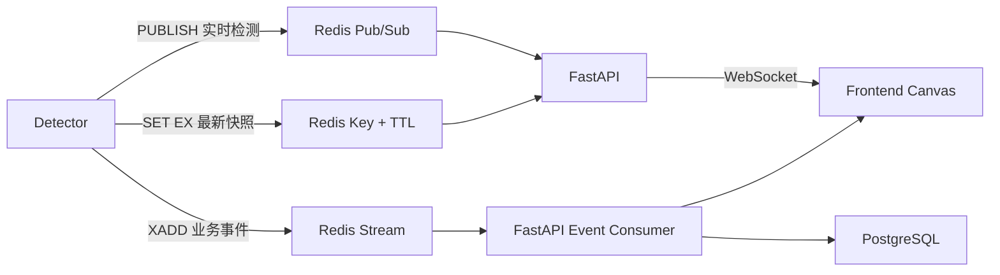

# 检测数据的 Redis 实时传输与 FastAPI 消费最佳实践

> 适用项目：SOP Vision  
> 目标读者：首次使用 Redis 的开发者  
> 文档范围：Detector 如何发布检测数据，FastAPI 如何消费数据并通过 WebSocket 推送给前端

## 1. 结论

SOP Vision 不应使用单一 Redis 通信方式承载所有数据。推荐根据数据语义组合使用以下三种能力：

| 数据类型 | Redis 能力 | 使用原因 |
| --- | --- | --- |
| bbox、跟踪位置、实时人数、FPS | Pub/Sub | 延迟低；数据很快过期，偶尔丢失不影响业务 |
| 最新一帧检测结果、任务当前状态 | `SET` + TTL | 页面刚打开时可以立即读取快照；过期数据自动清理 |
| SOP 违规、告警等业务事件 | Redis Stream | 支持消息确认、重试及断线恢复 |
| 摄像头、检测任务、算法配置 | 不使用 Redis 作为唯一存储 | 此类数据应持久化到 PostgreSQL |

因此，“FastAPI 是否通过 Redis Pub/Sub 获取 Detector 的检测数据”的答案是：

> 高频实时检测数据使用 Pub/Sub，但不能把所有数据都放进 Pub/Sub。最新快照使用带 TTL 的 Key，需要可靠处理的业务事件使用 Redis Stream。

推荐的整体数据流如下：



## 2. Redis 在本项目中的角色

Redis 是一个独立服务，不是 FastAPI 的插件，也不是 Python 进程内的变量。Detector 和 FastAPI 分别连接同一个 Redis 服务：

```text
Detector  ----\
               >---- Redis
FastAPI   ----/
```

Detector 负责生产检测数据，FastAPI 负责消费和聚合检测数据，浏览器不直接连接 Redis：

```text
Detector → Redis → FastAPI → WebSocket → Browser
```

前端视频仍然由 MediaMTX 提供，不经过 Redis 或 FastAPI：

```text
MediaMTX → WebRTC/WHEP → Browser <video>
```

最终浏览器将两条数据链路组合起来：

```text
<video>  播放 MediaMTX 提供的视频
<canvas> 绘制 FastAPI WebSocket 提供的 bbox、ROI 和状态文字
```

不要通过 Redis 传输原始视频帧、JPEG 图片或完整视频流。Redis 只传递检测元数据。

## 3. Pub/Sub 的基本概念

Pub/Sub 是 Publish/Subscribe，即发布/订阅。

Detector 向频道发布消息：

```text
PUBLISH vision:telemetry:task_001 "{...json...}"
```

FastAPI 订阅频道：

```text
SUBSCRIBE vision:telemetry:task_001
```

当 Detector 发布消息时，Redis 会立即把消息推给当前在线的所有订阅者。

### 3.1 Pub/Sub 不保存消息

如果 FastAPI 在消息发布时没有连接 Redis，这条消息就会丢失。FastAPI 重连后无法要求 Redis 重新发送之前的 Pub/Sub 消息。

这种语义很适合实时 bbox。假设 Detector 每秒发布 10 次检测结果，丢失第 51 个结果并不重要，因为约 100 毫秒后第 52 个结果就会到达。

以下数据适合 Pub/Sub：

- bbox。
- track 坐标。
- 当前人数。
- FPS。
- 推理耗时。
- GPU 使用率。
- 页面上实时显示但不需要回放的数据。

以下数据不适合只使用 Pub/Sub：

- SOP 违规。
- 安全告警。
- 洗手完成事件。
- 越界事件。
- 需要持久化、审计或生成证据的数据。

## 4. 按检测任务设计频道

本项目的产品模型允许同一个 `CameraSource` 绑定多个 `DetectionTask`：

```text
CameraSource 1 ── N DetectionTask
```

例如，同一个摄像头源可能同时运行：

- 人员检测算法。
- 安全帽检测算法。
- 越界检测算法。

因此，实时检测频道推荐按 `task_id` 划分：

```text
vision:telemetry:{task_id}
```

示例：

```text
vision:telemetry:task_person_001
vision:telemetry:task_helmet_001
vision:telemetry:task_intrusion_001
```

如果只使用 `camera_id` 作为频道，同一摄像头的多个算法结果会混合在一起，FastAPI 和前端还需要再次分流。使用 `task_id` 更符合当前 Detection Task 的业务边界。

消息中仍应携带完整关联信息，以便校验、追踪和排错。

## 5. 检测消息协议

推荐的实时检测消息如下：

```json
{
  "schema_version": 1,
  "type": "frame_detection",
  "task_id": "task_helmet_001",
  "camera_id": "cam_001",
  "source_id": "source_101",
  "algorithm_id": "helmet_detection",
  "algorithm_version": "1.2.0",
  "frame_id": 18272,
  "frame_ts_ms": 1786501200123,
  "published_at_ms": 1786501200180,
  "source_width": 1920,
  "source_height": 1080,
  "objects": [
    {
      "track_id": 12,
      "class_name": "person",
      "confidence": 0.96,
      "bbox": [0.21, 0.11, 0.48, 0.91],
      "attributes": {
        "helmet": false
      }
    }
  ],
  "metrics": {
    "inference_ms": 18.4,
    "fps": 24.7
  }
}
```

### 5.1 必须保留的字段

建议至少包含：

- `schema_version`：消息协议版本，便于以后升级。
- `task_id`：消息所属检测任务，也是频道路由依据。
- `camera_id`：物理摄像头标识。
- `source_id`：摄像头视频源标识。
- `algorithm_id`：算法标识。
- `frame_id`：Detector 内部单调递增的帧编号。
- `frame_ts_ms`：原始帧时间戳，使用 UTC Unix 毫秒。
- `published_at_ms`：发布到 Redis 前的时间戳，用于测量数据链路延迟。
- `source_width`、`source_height`：原始画面尺寸。
- `objects`：目标检测结果。

### 5.2 bbox 使用归一化坐标

推荐使用：

```text
[x1, y1, x2, y2]
```

四个数值都在 `[0, 1]` 范围内。例如：

```json
"bbox": [0.21, 0.11, 0.48, 0.91]
```

归一化坐标不依赖前端当前显示分辨率。前端绘制时：

```javascript
const x1 = bbox[0] * canvas.width;
const y1 = bbox[1] * canvas.height;
const x2 = bbox[2] * canvas.width;
const y2 = bbox[3] * canvas.height;
```

## 6. Redis Key、Channel 和 Stream 命名

建议统一采用 `vision` 前缀：

```text
# 实时检测频道
vision:telemetry:{task_id}

# 最新检测结果，建议 TTL 为 5 秒
vision:task:{task_id}:latest

# 检测任务运行状态
vision:task:{task_id}:runtime

# Detector 心跳，建议 TTL 为 10 秒
vision:worker:{worker_id}:heartbeat

# 可靠业务事件 Stream
vision:events
```

Detector 每次发布实时结果时，同时执行：

```text
SET vision:task:task_001:latest "{JSON}" EX 5
PUBLISH vision:telemetry:task_001 "{JSON}"
```

两条命令的作用不同：

- `PUBLISH` 将结果实时推送给在线的 FastAPI。
- `SET ... EX 5` 保存最近一次结果，5 秒后自动过期。
- 页面刚打开时可以先读取 latest Key，不必等待 Detector 产生下一次结果。
- Detector 停止后 Key 自动过期，避免页面长期展示陈旧数据。

## 7. 在 Compose 中加入 Redis

在项目根目录的 `compose.yaml` 中增加 Redis 服务和数据卷：

```yaml
volumes:
  postgres-data:
  redis-data:

services:
  redis:
    image: redis:${REDIS_IMAGE_TAG:-7-alpine}
    restart: unless-stopped
    command:
      - redis-server
      - --appendonly
      - "yes"
      - --appendfsync
      - everysec
    volumes:
      - redis-data:/data
    expose:
      - "6379"
    healthcheck:
      test: ["CMD", "redis-cli", "ping"]
      interval: 5s
      timeout: 3s
      retries: 5

  backend:
    environment:
      REDIS_URL: "${REDIS_URL:-redis://redis:6379/0}"
    depends_on:
      redis:
        condition: service_healthy
```

开发环境中 Redis 不需要通过 `ports` 暴露到宿主机。Backend 和未来的 Detector 都通过 Compose 内部服务名连接：

```text
redis://redis:6379/0
```

在 `.env.example` 中增加：

```dotenv
REDIS_IMAGE_TAG=7-alpine
REDIS_URL=redis://redis:6379/0
```

### 7.1 为什么启用 AOF

Pub/Sub 消息本身不会因为 AOF 而变得可恢复，但 Redis Stream 和普通 Key 可以被持久化。

```text
--appendonly yes
--appendfsync everysec
```

表示启用 AOF，并大约每秒同步一次。它适合本项目的普通部署，但仍可能损失最近约一秒的数据。非常关键的业务记录最终应进入 PostgreSQL，并结合 Redis 高可用、备份等机制设计。

## 8. Backend 安装 Python Redis 客户端

进入 Backend：

```bash
cd backend
uv add redis
```

异步 FastAPI 应使用：

```python
import redis.asyncio as redis
```

不要在异步接口中使用同步 Redis 客户端，否则 Redis 网络请求可能阻塞 FastAPI 事件循环。

在 `Settings` 中增加：

```python
class Settings(BaseSettings):
    # 其他现有字段省略
    redis_url: str = "redis://redis:6379/0"
```

## 9. Detector 发布实时检测数据

一个最小发布器如下：

```python
import redis.asyncio as redis

redis_client = redis.from_url(
    "redis://redis:6379/0",
    decode_responses=True,
)


async def publish_detection(task_id: str, payload_json: str) -> None:
    channel = f"vision:telemetry:{task_id}"
    latest_key = f"vision:task:{task_id}:latest"

    pipeline = redis_client.pipeline(transaction=False)
    pipeline.set(latest_key, payload_json, ex=5)
    pipeline.publish(channel, payload_json)
    await pipeline.execute()
```

使用 pipeline 可以减少网络往返次数。这里不要求 Redis 事务，因为 latest 快照和实时通知允许短暂的不一致。

### 9.1 不要阻塞推理主循环

以下写法不推荐：

```python
while True:
    frame = read_frame()
    result = detector.detect(frame)
    await publish_detection(result.task_id, result.model_dump_json())
```

如果 Redis 网络发生抖动，推理循环就会被拖慢。正确结构是：

```text
视频读取 / 推理 / Tracking
          │
          ▼
     有界最新值队列
          │
          ▼
独立 Redis Publisher Task
```

对于实时 bbox，队列满时应该丢弃旧结果并保留最新结果：

```python
import asyncio

telemetry_queue: asyncio.Queue[tuple[str, str]] = asyncio.Queue(maxsize=1)


def offer_latest(task_id: str, payload_json: str) -> None:
    if telemetry_queue.full():
        try:
            telemetry_queue.get_nowait()
        except asyncio.QueueEmpty:
            pass

    telemetry_queue.put_nowait((task_id, payload_json))


async def redis_publish_loop() -> None:
    while True:
        task_id, payload_json = await telemetry_queue.get()

        try:
            await publish_detection(task_id, payload_json)
        except Exception:
            # Realtime telemetry 可以丢弃。
            # 正式代码应记录限频日志和失败指标。
            pass
        finally:
            telemetry_queue.task_done()
```

这样 Redis 暂时不可用时：

- Detector 继续执行推理。
- 队列不会无限增长。
- 旧 bbox 被丢弃。
- Redis 恢复后继续发送新的结果。

如果推理发生在普通线程中，不要直接从推理线程操作 `asyncio.Queue`。可以使用 `loop.call_soon_threadsafe()` 将数据安全地交给 asyncio 事件循环，或者使用专用 Publisher 线程和 `queue.Queue(maxsize=1)`。

### 9.2 建议限制发布频率

Detector 可以按 25 FPS 或更高频率执行推理，但浏览器通常不需要以相同频率接收检测元数据。

第一版建议：

```text
内部推理：按算法实际需求运行
Redis telemetry 发布：5～10 Hz
```

这样可以显著降低：

- Redis 消息量。
- FastAPI JSON 解析压力。
- WebSocket 带宽。
- 浏览器 Canvas 绘制压力。

## 10. FastAPI DetectionHub

在当前项目中，建议新增以下模块：

```text
backend/src/app/modules/detection_runtime/
├── __init__.py
├── api/
│   ├── __init__.py
│   └── websocket.py
├── schemas/
│   ├── __init__.py
│   └── detection.py
└── services/
    ├── __init__.py
    └── detection_hub.py
```

不要在每个 WebSocket 请求中创建独立 Redis 客户端。应该在 FastAPI lifespan 中创建共享 Redis 客户端和一个 Pub/Sub reader task。

下面是简化的 `DetectionHub`：

```python
import asyncio
import logging
from collections import defaultdict
from contextlib import suppress

import redis.asyncio as redis
from redis.exceptions import RedisError

logger = logging.getLogger(__name__)


class DetectionHub:
    def __init__(self, redis_client: redis.Redis) -> None:
        self.redis = redis_client
        self.subscribers: dict[str, set[asyncio.Queue[str]]] = defaultdict(set)
        self.reader_task: asyncio.Task[None] | None = None

    async def start(self) -> None:
        self.reader_task = asyncio.create_task(
            self._consume_forever(),
            name="redis-detection-subscriber",
        )

    async def stop(self) -> None:
        if self.reader_task is None:
            return

        self.reader_task.cancel()
        with suppress(asyncio.CancelledError):
            await self.reader_task

    def subscribe(self, task_id: str) -> asyncio.Queue[str]:
        # 每个浏览器最多积压一条，慢客户端自动丢掉旧结果。
        queue: asyncio.Queue[str] = asyncio.Queue(maxsize=1)
        self.subscribers[task_id].add(queue)
        return queue

    def unsubscribe(self, task_id: str, queue: asyncio.Queue[str]) -> None:
        queues = self.subscribers.get(task_id)
        if not queues:
            return

        queues.discard(queue)
        if not queues:
            self.subscribers.pop(task_id, None)

    def _broadcast(self, task_id: str, payload: str) -> None:
        for queue in tuple(self.subscribers.get(task_id, ())):
            if queue.full():
                try:
                    queue.get_nowait()
                except asyncio.QueueEmpty:
                    pass

            queue.put_nowait(payload)

    async def _consume_forever(self) -> None:
        retry_delay = 1.0

        while True:
            try:
                async with self.redis.pubsub() as pubsub:
                    await pubsub.psubscribe("vision:telemetry:*")
                    retry_delay = 1.0

                    async for message in pubsub.listen():
                        if message["type"] != "pmessage":
                            continue

                        channel = message["channel"]
                        payload = message["data"]
                        task_id = channel.rsplit(":", maxsplit=1)[-1]

                        # 正式代码应在这里使用 Pydantic 校验 JSON，
                        # 并确认消息中的 task_id 与频道 task_id 相同。
                        self._broadcast(task_id, payload)

            except asyncio.CancelledError:
                raise
            except RedisError:
                logger.exception("Redis Pub/Sub disconnected")
                await asyncio.sleep(retry_delay)
                retry_delay = min(retry_delay * 2, 30.0)
```

这个实现解决了几个重要问题：

- 一个 FastAPI 进程只维护一个 Pub/Sub reader。
- Redis 断线后自动重连。
- Redis 暂时不可用时，其他 REST API 仍可工作。
- 每个浏览器拥有独立的长度为 1 的队列。
- 慢浏览器不会阻塞其他浏览器。
- 旧检测结果会被主动丢弃，只保留最新结果。

正式实现还应使用 Pydantic 校验消息，不能无条件信任 Detector 输入。

## 11. 接入 FastAPI lifespan

当前项目的 `backend/src/app/main.py` 已经使用 lifespan 管理 MediaMTX Client。Redis 也应在同一个 lifespan 中创建和清理：

```python
from collections.abc import AsyncGenerator
from contextlib import asynccontextmanager

import redis.asyncio as redis
from fastapi import FastAPI


@asynccontextmanager
async def lifespan(application: FastAPI) -> AsyncGenerator[None]:
    settings = get_settings()

    mediamtx_client = MediaMTXClient(
        base_url=settings.mediamtx_api_url,
        timeout=settings.mediamtx_api_timeout,
    )

    redis_client = redis.from_url(
        settings.redis_url,
        decode_responses=True,
        health_check_interval=30,
    )
    detection_hub = DetectionHub(redis_client)

    application.state.stream_gateway_mediamtx_client = mediamtx_client
    application.state.redis = redis_client
    application.state.detection_hub = detection_hub

    await detection_hub.start()

    try:
        yield
    finally:
        await detection_hub.stop()
        await redis_client.aclose()
        await mediamtx_client.close()
```

注意关闭顺序：

1. 先停止 Pub/Sub 后台 reader。
2. 再关闭 Redis Client 和连接池。
3. 最后清理其他共享资源。

## 12. WebSocket 接口

前端通过 FastAPI WebSocket 获取实时检测数据：

```text
ws://localhost:8000/api/v1/ws/detection-tasks/task_001
```

示例接口：

```python
from fastapi import APIRouter, WebSocket, WebSocketDisconnect

router = APIRouter()


@router.websocket("/api/v1/ws/detection-tasks/{task_id}")
async def detection_websocket(
    websocket: WebSocket,
    task_id: str,
) -> None:
    # 正式代码应在 accept 前验证：
    # 1. 用户身份与权限。
    # 2. task_id 是否存在。
    # 3. 用户是否有权查看此任务。

    await websocket.accept()

    hub = websocket.app.state.detection_hub
    redis_client = websocket.app.state.redis
    queue = hub.subscribe(task_id)

    try:
        # 连接后先发送最近一帧，避免等待下一次 Pub/Sub 消息。
        latest = await redis_client.get(f"vision:task:{task_id}:latest")
        if latest is not None:
            await websocket.send_text(latest)

        # 然后持续发送 Pub/Sub 实时结果。
        while True:
            payload = await queue.get()
            await websocket.send_text(payload)

    except WebSocketDisconnect:
        pass
    finally:
        hub.unsubscribe(task_id, queue)
```

正式版本还应处理：

- WebSocket 鉴权。
- Task 是否存在以及是否启用。
- 最大连接数。
- 空闲超时和心跳。
- 客户端异常断开。
- 发送失败日志和指标。

## 13. 前端去重和绘制

WebSocket 建立时，FastAPI 会先读取 latest Key，然后继续转发 Pub/Sub 消息。两者可能包含相同帧，因此前端应根据 `frame_id` 去重：

```javascript
let lastFrameId = -1;

socket.onmessage = (event) => {
  const result = JSON.parse(event.data);

  if (result.frame_id <= lastFrameId) {
    return;
  }

  lastFrameId = result.frame_id;
  drawDetections(result);
};
```

前端还应结合 `frame_ts_ms` 处理视频和 bbox 的链路延迟差异。第一版可以直接绘制，并记录以下延迟：

```text
浏览器收到时间 - frame_ts_ms
```

如果后续发现 overlay 明显错位，再增加小型 jitter buffer、时间戳匹配或 tracker 位置预测。

## 14. 使用 Redis Stream 处理可靠业务事件

假设 Detector 发现一个 SOP 违规事件：

```json
{
  "event_id": "evt_0192",
  "type": "sop_violation",
  "task_id": "task_001",
  "occurred_at_ms": 1786501200123,
  "attributes": {
    "rule": "helmet_required",
    "track_id": 12
  }
}
```

Detector 将它写入 Stream：

```python
await redis_client.xadd(
    "vision:events",
    {
        "event_id": event.event_id,
        "payload": event.model_dump_json(),
    },
    maxlen=100_000,
    approximate=True,
)
```

`maxlen` 防止 Stream 无限增长，`approximate=True` 允许 Redis 使用更高效的近似裁剪。

FastAPI 使用 Consumer Group 消费：

```python
messages = await redis_client.xreadgroup(
    groupname="backend-event-persistence",
    consumername="backend-01",
    streams={"vision:events": ">"},
    count=100,
    block=5000,
)
```

只有在事件成功写入 PostgreSQL 后才确认：

```python
await save_event_to_postgresql(event)

await redis_client.xack(
    "vision:events",
    "backend-event-persistence",
    message_id,
)
```

完整语义为：

```text
读取 Stream 消息
       │
       ▼
消息进入 Pending Entries List
       │
       ▼
写入 PostgreSQL
       │
       ├── 成功 → XACK
       │
       └── 失败 → 保持 Pending，稍后重试
```

如果 FastAPI 在写数据库之前崩溃，消息仍保留在 Pending 中。其他消费者可以使用 `XAUTOCLAIM` 接管长时间未确认的消息。

### 14.1 Stream 不是 Exactly Once

Redis Stream Consumer Group 通常提供至少一次处理语义。极端情况下，同一条事件可能被处理两次。

因此，事件必须有稳定的 `event_id`，并在 PostgreSQL 中为 `event_id` 添加唯一约束：

```text
UNIQUE(event_id)
```

重复消费时，通过数据库唯一约束实现幂等，而不是假设消息永远只到达一次。

## 15. FastAPI 横向扩容时的注意事项

假设有两个 FastAPI 实例：

```text
FastAPI A：连接浏览器 A
FastAPI B：连接浏览器 B
```

对于实时 bbox，A 和 B 都必须收到相同消息，所以每个 FastAPI 实例都应该订阅 Pub/Sub：

```text
Detector PUBLISH
       │
       ├── FastAPI A → Browser A
       └── FastAPI B → Browser B
```

不要使用同一个 Redis Stream Consumer Group 分发实时 bbox：

```text
Stream Consumer Group 将一条消息只交给组内某个消费者处理
```

如果消息被 FastAPI A 消费，连接在 FastAPI B 上的浏览器就可能看不到这一帧。

两种机制的用途应保持清晰：

| 机制 | 多实例行为 | 适用场景 |
| --- | --- | --- |
| Pub/Sub | 所有订阅实例都收到 | WebSocket 实时广播 |
| Stream Consumer Group | 组内实例分摊消息 | 数据库落库、异步业务处理 |

## 16. 背压设计

实时检测链路上的所有队列都必须是有界的：

```text
Detector Publisher Queue：长度 1 或很小
FastAPI 每个 WebSocket Queue：长度 1
```

原因是实时检测结果具有明确的“新数据覆盖旧数据”语义。如果浏览器只能每秒处理 2 条，而 Detector 每秒发送 10 条，累计 100 条旧 bbox 没有意义。

正确行为：

```text
浏览器处理不过来 → 丢弃旧 bbox → 下一次发送最新 bbox
```

错误行为：

```text
浏览器处理不过来 → 队列无限增长 → 内存上升 → 页面显示数秒前的框
```

业务事件不能用同样的丢弃策略。业务事件应进入 Stream，并通过限流、消费者扩容或告警解决积压问题。

## 17. 故障场景

### 17.1 Redis 暂时不可用

- Detector 继续使用当前配置执行推理。
- Detector 的实时 telemetry Publisher 丢弃失败数据，不阻塞推理。
- FastAPI Pub/Sub reader 按指数退避重连。
- REST 控制面可以继续提供不依赖 Redis 的功能。
- 页面暂时收不到 bbox，Redis 恢复后自动继续。

### 17.2 FastAPI 重启

- Detector 不受影响，继续推理和发布。
- 重启期间的 Pub/Sub bbox 会丢失，这是预期行为。
- FastAPI 启动后重新订阅。
- 页面重连后先从 latest Key 获取最近结果。

### 17.3 浏览器断开

- WebSocket `finally` 中取消本地订阅。
- Redis Pub/Sub reader 继续服务其他客户端。
- Detector 不感知浏览器连接状态。

### 17.4 Detector 停止

- `vision:task:{task_id}:latest` 在 TTL 到期后自动消失。
- Worker heartbeat 在 TTL 到期后自动消失。
- FastAPI 据此将任务或 Worker 判断为离线，而不是永久展示最后一次状态。

## 18. 安全建议

- 浏览器不能直接连接 Redis。
- Redis 不应公开到互联网。
- Compose 内部使用 `expose`，非必要不映射宿主机端口。
- 生产环境启用 Redis 用户、密码或 ACL。
- WebSocket 在订阅前验证用户身份和任务访问权限。
- FastAPI 使用 Pydantic 校验 Detector 消息。
- 校验频道中的 `task_id` 与消息体中的 `task_id` 是否一致。
- 限制单条消息大小，避免异常消息耗尽内存。
- 不通过 Redis 消息发送摄像头密码和 RTSP 凭证。

## 19. 可观测性建议

至少记录以下指标：

```text
Detector：
- redis_publish_success_total
- redis_publish_failure_total
- telemetry_dropped_total
- telemetry_payload_bytes

FastAPI：
- redis_pubsub_connected
- redis_reconnect_total
- websocket_connections
- websocket_dropped_messages_total
- invalid_detection_messages_total

Stream Consumer：
- event_processed_total
- event_failed_total
- stream_pending_count
- event_processing_latency_ms
```

不要为每一帧检测结果记录普通 INFO 日志，否则日志量会非常大。逐帧日志应关闭或只用于短期 DEBUG。

## 20. 推荐实施顺序

当前版本尚不实现历史检测和异常证据，因此建议分阶段落地。

### 第一阶段：实时结果 MVP

1. 在 Compose 中加入 Redis。
2. Backend 安装 `redis` Python 包。
3. 增加 `REDIS_URL` 配置。
4. 定义 Pydantic 检测消息模型。
5. Detector 使用 `task_id` 发布 Pub/Sub 消息。
6. Detector 同时维护 5 秒 TTL 的 latest Key。
7. FastAPI lifespan 启动一个 `DetectionHub`。
8. 增加 Detection Task WebSocket 接口。
9. 前端通过 `<canvas>` 绘制 bbox，并按 `frame_id` 去重。
10. 验证 Redis、FastAPI 和浏览器断线重连。

### 第二阶段：运行时状态

1. 增加 Worker heartbeat。
2. 增加 Detection Task Actual State。
3. 增加 Redis 就绪状态和运行指标。
4. 在 Detection Task 页面展示状态、FPS 和错误信息。

### 第三阶段：可靠业务事件

1. 增加 `vision:events` Stream。
2. 创建 FastAPI Consumer Group。
3. 将事件持久化到 PostgreSQL。
4. 使用 `event_id` 唯一约束保证幂等。
5. 增加 Pending、重试和死信处理。

## 21. 第一版最终链路

第一版只需完成以下核心路径：

```text
Detector
  ├── SET vision:task:{task_id}:latest EX 5
  └── PUBLISH vision:telemetry:{task_id}
                   │
                   ▼
          FastAPI DetectionHub
                   │
                   ▼
              WebSocket
                   │
                   ▼
          Browser Canvas Overlay
```

对应的系统职责是：

- Detector：检测、生成协议消息、限频、非阻塞发布。
- Redis：实时广播、保存短期最新快照。
- FastAPI：校验、聚合、鉴权、连接管理和 WebSocket 转发。
- MediaMTX：提供视频。
- Browser：播放视频并绘制检测层。
- PostgreSQL：保存正式业务配置，以及未来需要持久化的业务事件。

## 22. 参考资料

- [redis-py asyncio 示例](https://github.com/redis/redis-py/blob/v6.4.0/docs/examples/asyncio_examples.ipynb)
- [FastAPI Lifespan](https://fastapi.tiangolo.com/advanced/events/)
- [FastAPI WebSocket](https://fastapi.tiangolo.com/advanced/websockets/)
- [Redis Pub/Sub](https://redis.io/docs/latest/develop/interact/pubsub/)
- [Redis Streams](https://redis.io/docs/latest/develop/data-types/streams/)

